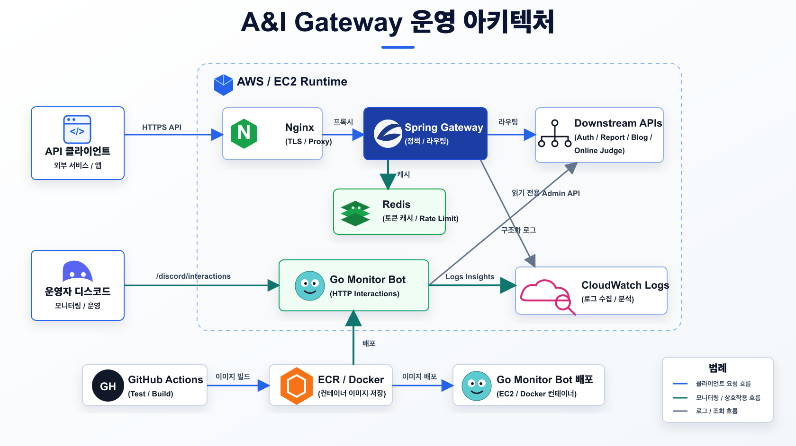
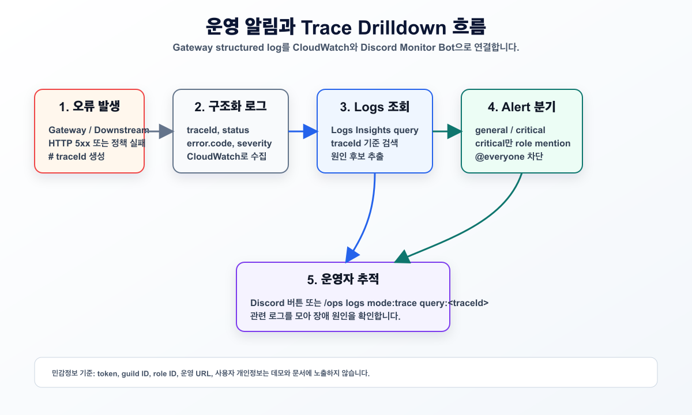
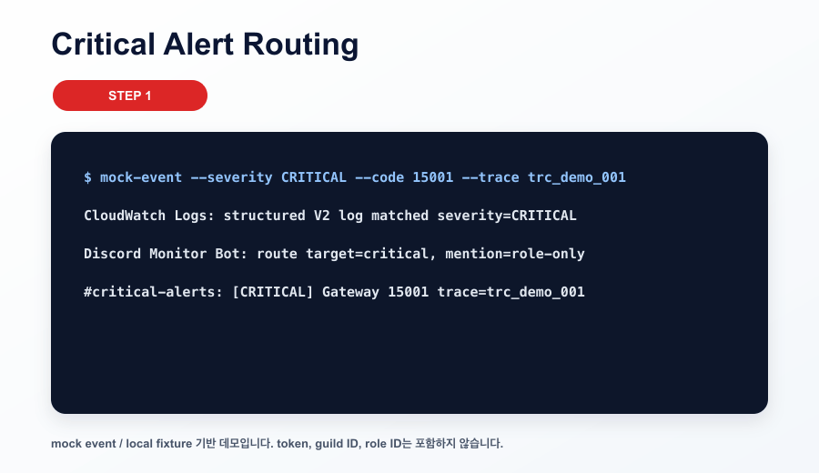
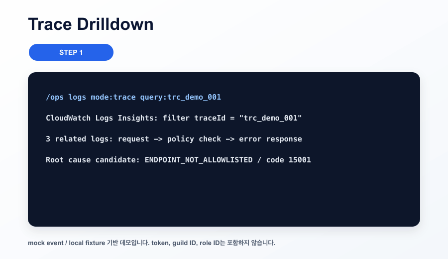
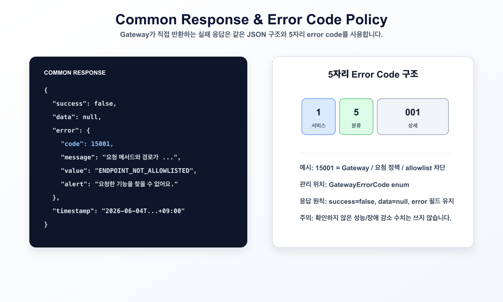

# A&I Gateway & Operation Monitor

> 본 프로젝트는 A&I의 여러 서버 앞단에서 요청을 라우팅하고, 운영 로그와 장애 신호를 Discord에서 확인할 수 있게 만든 Gateway/운영 모니터링 서버입니다.

## 1. 왜 만들었나

A&I 서비스가 Auth, Web, Blog, Online Judge처럼 여러 서버로 나뉘면 클라이언트 진입점, 인증/인가 정책, 실패 응답 형식, 운영 로그 확인 방식이 흩어집니다. 이 저장소는 Kotlin / Spring Boot 기반 Gateway가 공통 정책을 먼저 적용하고, Go 기반 Discord Monitor Bot이 CloudWatch Logs와 운영 알림 흐름을 연결하도록 정리한 프로젝트입니다.

이 README는 이력서에서 **MSA Gateway**와 **운영 관찰가능성** 근거로 연결하기 위해 아래 4가지만 보여줍니다.

- 여러 서버 앞단의 Gateway 역할
- Discord Monitor Bot 기반 운영 알림 흐름
- CloudWatch Logs 기반 trace drilldown
- Common Response와 5자리 Error Code Policy

## 2. 한눈에 보는 구조



원본 다이어그램: [architecture.drawio](docs/assets/diagrams/architecture.drawio)

| 구성요소 | 역할 |
| :--- | :--- |
| Spring Gateway | 외부 요청을 내부 서버 후보로 라우팅하고 Gateway 공통 정책을 적용합니다. |
| Downstream APIs | Auth / Web / Blog / OJ 서버 후보입니다. 세부 라우팅 목록은 README에 나열하지 않습니다. |
| CloudWatch Logs | Gateway structured log와 trace drilldown의 조회 대상입니다. |
| Discord Monitor Bot | Gateway JVM과 분리된 Go HTTP Interactions sidecar입니다. |
| Discord Channel | general alert와 critical alert를 분리해 운영자가 확인합니다. |
| Error Response Policy | 공통 실패 응답과 5자리 error code 기준을 제공합니다. |

## 3. 운영 알림 흐름



원본 다이어그램: [ops-flow.drawio](docs/assets/diagrams/ops-flow.drawio)

1. Gateway 또는 downstream 서버에서 오류가 발생합니다.
2. Gateway는 traceId, HTTP status, error code, severity를 구조화 로그로 남깁니다.
3. CloudWatch Logs Insights에서 traceId 기준으로 관련 로그를 조회합니다.
4. Discord Monitor Bot은 general alert와 critical alert를 분리합니다.
5. 운영자는 Discord alert의 traceId나 `/ops logs mode:trace` 흐름으로 원인 후보를 좁힙니다.

## 4. 핵심 기능과 동작 증거

### MSA Gateway

Gateway는 여러 내부 서버 앞단에서 요청 정책을 먼저 검사하고, 허용되지 않은 요청은 downstream으로 전달하지 않습니다. 실패 응답은 `success=false`, `data=null`, `error`, `timestamp` 구조를 유지합니다.

### Discord Monitor Bot / Critical Alert



이 GIF는 운영 token 없이 만든 mock event 기반 데모입니다. critical severity 로그가 들어오면 Monitor Bot이 critical alert 경로로 분기하고, critical alert에만 role mention 정책을 적용하는 흐름을 보여줍니다. `@everyone`, `@here` 같은 전체 멘션은 데모와 문서에 넣지 않았습니다.

### Trace Drilldown / CloudWatch Logs



이 GIF는 mock traceId를 사용합니다. 운영자는 traceId를 기준으로 CloudWatch Logs Insights 조회 흐름을 따라가며 request, policy check, error response 로그를 묶어 원인 후보를 확인합니다.

### Common Response / Error Code Policy



Gateway 직접 발행 error code는 5자리 정수로 관리합니다. 예시 `15001`은 Gateway 서비스 영역의 요청 정책 실패 중 allowlist 차단을 의미합니다.

```json
{
  "success": false,
  "data": null,
  "error": {
    "code": 15001,
    "message": "요청 메서드와 경로가 게이트웨이 허용 목록에 없습니다.",
    "value": "ENDPOINT_NOT_ALLOWLISTED",
    "alert": "요청한 기능을 찾을 수 없어요."
  },
  "timestamp": "2026-06-04T17:08:18.537129+09:00"
}
```

## 5. 테스트와 검증


| 항목 | 결과 |
| :--- | :--- |
| JVM test | `./gradlew clean test` PASS |
| JVM coverage | JaCoCo line `91.32%`, branch `65.17%`, instruction `89.60%` |
| Go test | `cd monitor-bot && go test ./...` PASS |
| Go coverage | total statements `59.2%` |
| Local smoke | health `200 OK`, allowlist 차단 `15001 ENDPOINT_NOT_ALLOWLISTED` |
| CI | `.github/workflows/ci.yml`에서 JVM test와 Go test 실행 |

측정 상세: [MEASUREMENT.md](docs/MEASUREMENT.md)

데모 캡처 기준: [DEMO_CAPTURE.md](docs/DEMO_CAPTURE.md)

현재 Gateway latency, alert delivery latency, throughput의 before/after 측정값은 없습니다. 성능 개선률, 장애 대응 시간 단축률, Redis만 근거로 한 성능 개선 문장은 쓰지 않습니다.

## 6. 이력서에 연결할 문장

- MSA 환경에서 Auth, Web, Blog, OJ 서버 앞단의 요청 정책과 실패 응답을 일관되게 적용하기 위해 Kotlin / Spring Boot 기반 Gateway를 구성했습니다.
- Gateway JVM과 분리된 Go HTTP Interactions sidecar로 Discord Monitor Bot을 운영하고, CloudWatch Logs 기반 general / critical alert 흐름을 정리했습니다.
- 공통 응답 구조와 5자리 error code 정책을 Gateway 실패 응답에 적용해 traceId와 error code로 장애 원인 후보를 추적할 수 있게 했습니다.

## 7. 실행과 확인

```bash
./gradlew clean test
cd monitor-bot && go test ./...
cd monitor-bot && go test ./... -cover
```

로컬 smoke check는 운영 인증값 없이 내부 이벤트 검증값을 로컬 더미값으로 주입해 실행했습니다. 더미값 자체는 문서에 남기지 않습니다.

```bash
SERVER_PORT=18080 MANAGEMENT_SERVER_PORT=19090 ./gradlew bootRun
curl -sS -i http://localhost:19090/actuator/health
curl -sS -i http://localhost:18080/not-allowlisted
```

핵심 코드 근거:

| 구분 | 위치 |
| :--- | :--- |
| Gateway 요청 정책 | `src/main/kotlin/com/aandi/gateway/security/GatewayRequestPolicyFilter.kt` |
| 공통 응답 / error code | `src/main/kotlin/com/aandi/gateway/common/response/GatewayResponse.kt` |
| trace header / structured log | `src/main/kotlin/com/aandi/gateway/logging/RequestResponseLoggingFilter.kt` |
| Discord command schema | `monitor-bot/internal/discord/commands.go` |
| alert routing / role mention 제한 | `monitor-bot/internal/monitor/alerts.go` |
