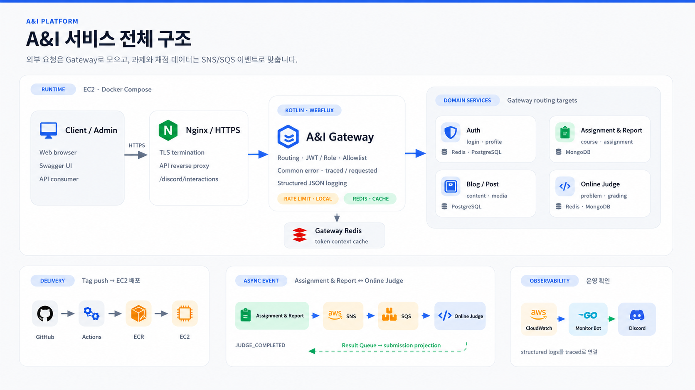
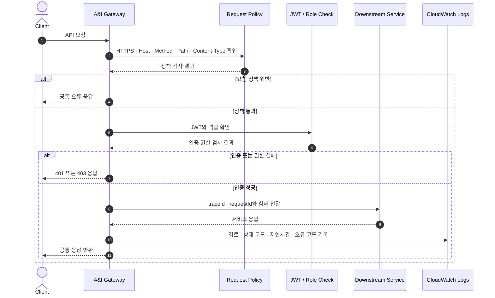
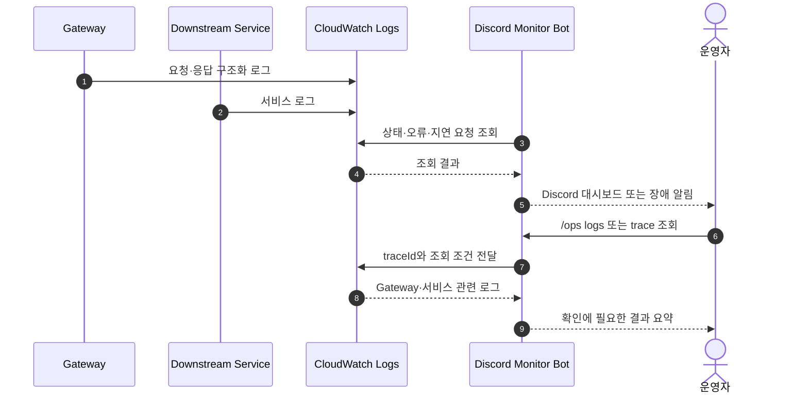

# A&I Gateway Server

> Auth, Assignment & Report, Blog, Online Judge로 나뉜 A&I 백엔드의 공통 진입점입니다.

클라이언트는 서비스마다 다른 주소와 인증 규칙을 알 필요 없이 Gateway 한 곳으로 요청합니다.

Gateway는 요청을 전달하기 전에 공통 정책과 권한을 확인하고, 응답 뒤에는 같은 요청을 끝까지 따라갈 수 있는 로그를 남깁니다.

## A&I 서비스 전체 구조



외부 요청은 Nginx와 Gateway를 거쳐 각 서비스로 전달됩니다.

과제와 채점 데이터는 서비스끼리 직접 호출하지 않고 SNS/SQS 이벤트로 맞춥니다.

## Gateway와 운영 조회 구조


Gateway는 라우팅, JWT 권한 검사, allowlist, 공통 오류 응답과 구조화 로그를 담당합니다.

인증 요청 제한은 Gateway 인스턴스 안에서 처리하고, Redis는 token context cache에 사용합니다.

Discord Monitor Bot은 Gateway JVM과 분리된 Go sidecar입니다.

CloudWatch Logs와 WEB Admin GET API를 읽기 전용으로 조회하며 서비스 데이터를 바꾸는 명령은 제공하지 않습니다.

## 요청 처리 흐름



허용되지 않은 요청은 downstream까지 보내지 않고 Gateway에서 종료합니다.

`traceId`와 `requestId`는 서비스 요청과 로그에 함께 남아 Gateway와 각 서비스의 기록을 하나의 요청으로 이어 줍니다.

## 장애 확인 흐름




`/ops dashboard`, `/ops logs`, `/ops alert`, `/ops assignment`, `/ops help` 다섯 가지 명령 묶음으로 운영 상태를 확인합니다.


동일한 원인의 장애는 cooldown 동안 반복 전송하지 않습니다.

CRITICAL 서버 장애만 전용 채널과 허용된 운영자 역할 mention을 사용합니다.

## 운영 조회 근거

| 항목 | 확인값 | 확인 조건 | 출처 | 이력서 사용 |
| :--- | :--- | :--- | :--- | :--- |
| traceId/requestId 전파 | `X-Trace-Id`, `X-Request-Id`를 요청과 응답 헤더에 설정하고 `trace.traceId`, `trace.requestId` 로그 필드에 기록 | Gateway request/response logging filter 기준 | `src/main/kotlin/com/aandi/gateway/logging/ApiLogContext.kt`, `RequestResponseLoggingFilter.kt`, `ApiLogModels.kt` (HEAD `9c3bcf8`) | 가능 |
| 구조화 로그 필드 | `service`, `trace`, `http`, `headers`, `client`, `actor`, `request`, `response`, `tags` 필드로 API 로그 생성 | Gateway structured logger 기준 | `src/main/kotlin/com/aandi/gateway/logging/ApiLogModels.kt`, `ApiLogFactory.kt`, `logback-spring.xml` (HEAD `9c3bcf8`) | 가능 |
| Discord 운영 명령 | `/ops dashboard`, `/ops logs`, `/ops alert`, `/ops assignment`, `/ops help` 5개 command family | Discord command definition 기준 | `monitor-bot/internal/discord/commands.go` (HEAD `9c3bcf8`) | 가능 |
| read-only 운영 조회 | Report Admin 서비스 데이터는 GET으로 조회하고, watch/alert/ack는 bot state와 Discord 메시지만 갱신 | Report Admin client와 bot state store 기준 | `monitor-bot/internal/reportadmin/client.go`, `monitor-bot/internal/state/store.go` (HEAD `9c3bcf8`) | 가능, downstream 서비스 데이터 변경 없음으로 제한 |
| CloudWatch Logs 조회 | `StartQuery`, `GetQueryResults`, `DescribeLogGroups`로 로그 조회 | AWS SDK CloudWatch Logs client 기준 | `monitor-bot/internal/cloudwatch/logs_client.go`, `monitor-bot/internal/cloudwatch/queries.go` (HEAD `9c3bcf8`) | 가능 |

## k6 부하 테스트


동일한 Mock Downstream에서 Direct P95는 `56.959 ms`, Gateway P95는 `65.357 ms`였고 추가 지연은 `8.399 ms`였습니다.

3회 측정의 HTTP 실패율은 `0.00%`, check 성공률은 `100.00%`였습니다.

이 결과는 정책·라우팅·로깅 계층의 회귀를 확인하기 위한 로컬 기준이며 운영 환경의 최대 처리량을 뜻하지 않습니다.

측정 근거는 다음과 같습니다.

| 항목 | 값 | 측정 조건 | 출처 | 이력서 사용 |
| :--- | ---: | :--- | :--- | :--- |
| Direct P95 | `56.959 ms` | Mock 지연 50ms, payload 1KB, 5 VUs, 1분, 3회 반복 중앙값 | `docs/performance/data/2026-06-20-gateway-local-check.json` (`median.directP95Ms`), 2026-06-20 KST, SHA `63b74ea80fcdee45db16dea830016357bf398254` | 가능, 로컬 회귀 기준으로만 |
| Gateway P95 | `65.357 ms` | 동일 조건에서 `/v2/blogs` public GET을 Gateway 경유로 호출 | `docs/performance/data/2026-06-20-gateway-local-check.json` (`median.gatewayP95Ms`), 2026-06-20 KST, SHA `63b74ea80fcdee45db16dea830016357bf398254` | 가능, 로컬 회귀 기준으로만 |
| Gateway 추가 P95 | `8.399 ms` | 각 Direct/Gateway 실행 쌍의 P95 차이를 계산한 뒤 3회 중앙값 사용 | `docs/performance/data/2026-06-20-gateway-local-check.json` (`median.gatewayAdditionalP95Ms`), 2026-06-20 KST, SHA `63b74ea80fcdee45db16dea830016357bf398254` | 가능, 추가 지연으로만 |
| HTTP 실패율 | `0.00%` | Direct/Gateway accepted pair 3회 기준 | `docs/performance/data/2026-06-20-gateway-local-check.json` (`median.httpFailedRate`), 2026-06-20 KST, SHA `63b74ea80fcdee45db16dea830016357bf398254` | 가능 |
| Check 성공률 | `100.00%` | Direct/Gateway accepted pair 3회 기준 | `docs/performance/data/2026-06-20-gateway-local-check.json` (`median.checkRate`), 2026-06-20 KST, SHA `63b74ea80fcdee45db16dea830016357bf398254` | 가능 |

해당 Direct/Gateway 비교는 `performance/k6/direct-upstream.js`와 `performance/k6/gateway-public-route.js` 기준의 `/v2/blogs` public GET 측정입니다.

JWT 검증과 Redis token context cache는 위 P95 비교에 포함하지 않았고, 보호 라우트 `/v1/me`는 `performance/k6/gateway-protected-route.js`에서 별도로 실행합니다.

## 테스트

[](https://github.com/Team-AnI/A-AND-I-GATEWAY-SERVER/actions/workflows/ci.yml)

CI에서 다음 항목을 모두 확인합니다.

- `./gradlew test` — Gateway 테스트
- `cd monitor-bot && go test ./...` — Monitor Bot 테스트
- `./gradlew bootJar` — 실행 JAR 빌드
- performance Python unit tests
- k6 시나리오와 생성 asset drift 검사

## 실행

```bash
docker compose up -d redis gateway
curl -i http://localhost:8080/actuator/health
```

```bash
./gradlew test
cd monitor-bot && go test ./...
```

## 기술 스택

| 영역 | 기술 |
| :--- | :--- |
| Gateway | Kotlin 2.2, Java 21, Spring Boot 4, Spring Cloud Gateway WebFlux |
| Security | Spring Security, OAuth2 Resource Server, JWT role policy |
| Cache | Redis Reactive |
| Observability | Structured logging, traceId/requestId, CloudWatch Logs |
| Monitor Bot | Go 1.24, Discord HTTP Interactions, AWS SDK |
| Infra | Docker, Docker Compose, Nginx, GitHub Actions |
| Performance | k6 |

## 참고 문서

- [Gateway 오류 계약](./docs/GATEWAY_ERROR_CODES.md)
- [서비스 연동 원칙](./docs/SERVICE_GATEWAY_INTEGRATION.md)
- [성능 측정 환경과 전체 결과](./docs/PERFORMANCE.md)
- [CI/CD 최적화 측정](./docs/cicd-optimization.md)
- [CI/CD 측정 감사](./docs/cicd-measurement-audit.md)
- [이력서 지표 후보](./docs/resume-metrics.md)
- [Discord Monitor Bot 실행과 운영](./monitor-bot/README.md)
