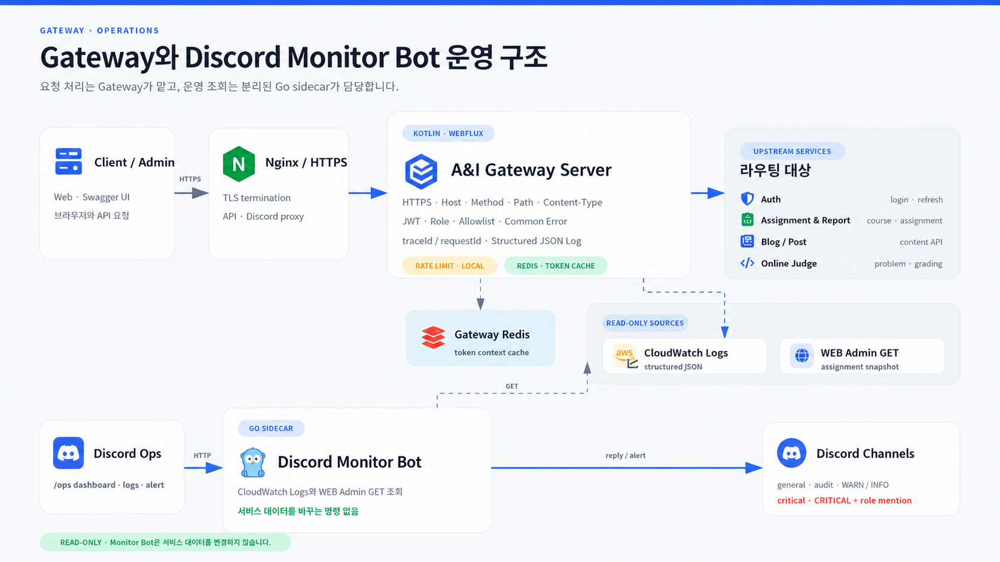
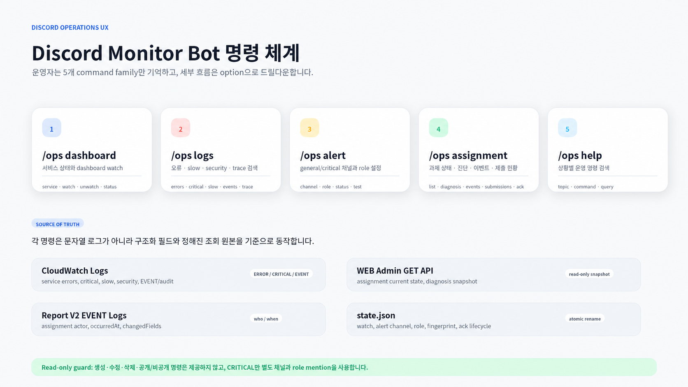
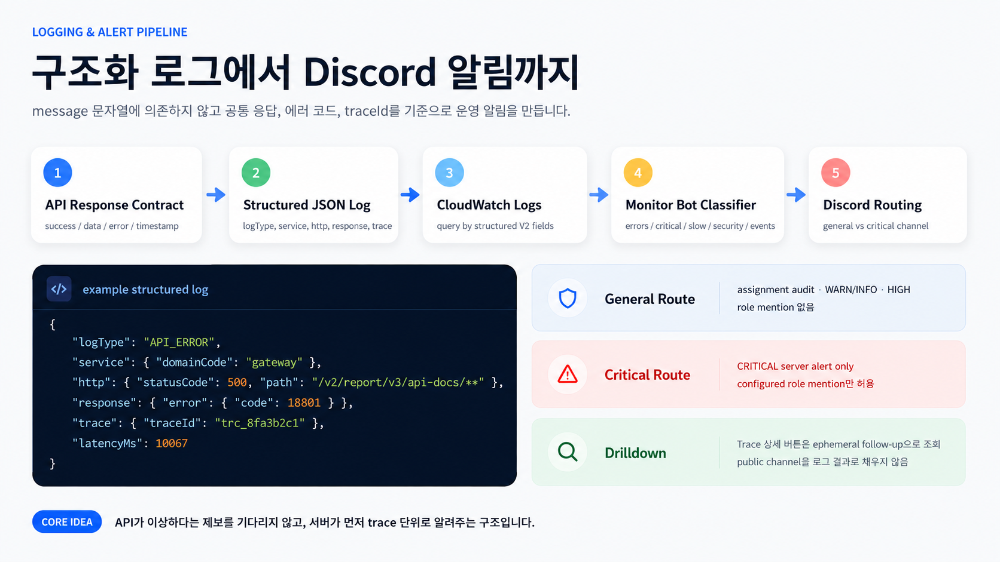
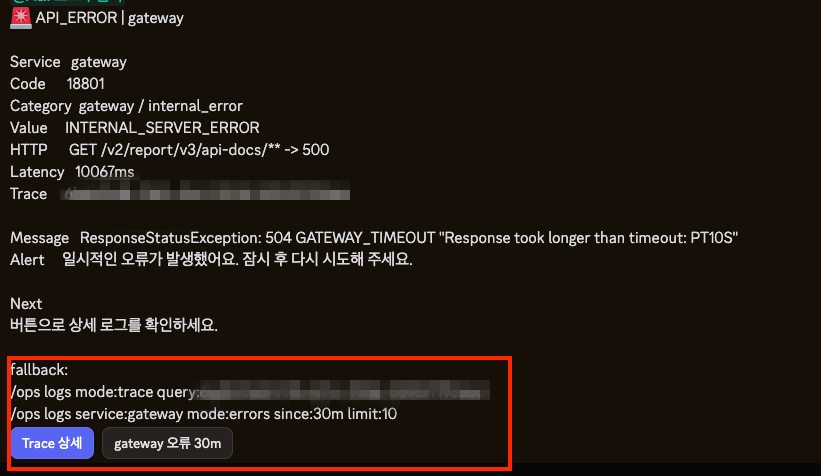
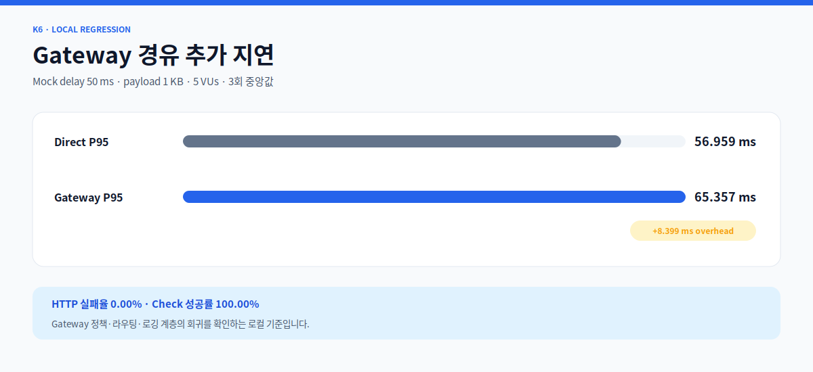

# A&I Gateway Server

> A&I의 Auth, Report, Blog, Online Judge 앞에서 요청 정책을 통일하고, 문제가 생겼을 때 같은 trace로 끝까지 따라갈 수 있게 만드는 엣지 서버입니다.

A&I는 기능별로 여러 백엔드가 나뉘어 있습니다. 클라이언트가 각 서버의 주소와 인증 규칙, 오류 형식을 따로 알지 않도록 외부 요청은 Gateway 한 곳으로 모았습니다.

이 저장소는 단순히 요청을 전달하는 데서 끝나지 않습니다. 요청이 downstream에 도달하기 전에 경로·메서드·Host·HTTPS·JWT 권한을 검사하고, 응답 이후에는 공통 오류 형식과 구조화 로그를 남깁니다. 함께 포함된 Discord Monitor Bot은 CloudWatch 로그를 읽어 운영자가 장애를 빠르게 좁혀 볼 수 있도록 돕는 read-only 도구입니다.



## 이 저장소가 A&I에서 맡는 일

### 하나의 API 진입점

Auth, Report, Blog, Online Judge로 향하는 요청을 하나의 도메인에서 받아 각 서비스로 라우팅합니다. 클라이언트는 서비스별 주소보다 A&I의 공통 API 계약에 집중할 수 있습니다.

### 공통 요청 정책

라우팅 전에 다음 정책을 먼저 적용합니다.

- 메서드·경로 allowlist와 explicit deny
- HTTPS와 허용 Host 검사
- `POST`, `PUT`, `PATCH` 요청의 JSON Content-Type 검사
- JWT 검증과 `USER`, `ORGANIZER`, `ADMIN` 역할별 접근 제어
- 로그인·토큰 갱신·로그아웃 요청 제한

정책에 맞지 않는 요청은 downstream으로 보내지 않고 Gateway의 공통 오류 응답으로 종료합니다.

### 장애 추적의 시작점

Gateway에서 `traceId`와 `requestId`를 생성하거나 전달하고, 요청 경로·상태 코드·오류 코드·지연시간을 JSON 로그로 남깁니다. 같은 trace를 기준으로 Gateway와 각 서비스의 로그를 이어서 볼 수 있습니다.

### 운영 조회 도구

Go로 작성한 Discord Monitor Bot은 Gateway 프로세스와 분리된 sidecar입니다. `/ops dashboard`, `/ops logs`, `/ops alert`, `/ops assignment`, `/ops help` 다섯 가지 명령 묶음으로 서비스 상태와 로그를 조회합니다.



과제 생성·수정·삭제 같은 쓰기 명령은 제공하지 않습니다. 운영 채널에서 사용할 수 있지만 서비스 데이터를 변경할 수 없는 도구로 범위를 제한했습니다.

## 요청 한 건은 이렇게 흐릅니다

1. Client가 Gateway로 요청합니다.
2. Gateway가 Host, HTTPS, 메서드·경로, Content-Type 정책을 검사합니다.
3. Spring Security가 JWT와 역할을 검증합니다.
4. 요청을 Auth, Report, Blog, Online Judge 중 알맞은 서비스로 전달합니다.
5. 응답을 공통 계약에 맞춰 반환하고 구조화 로그를 남깁니다.
6. 로그는 CloudWatch에 수집되며, 운영자는 Discord에서 오류·slow request·security event·trace를 조회합니다.



## 구현에서 중요하게 본 세 가지

### 허용된 요청만 downstream으로 보냅니다

라우트가 존재한다는 이유만으로 모든 요청을 통과시키지 않습니다. Gateway의 요청 정책 필터가 메서드와 경로 조합을 allowlist로 검사하고, 보안 설정이 역할별 접근 범위를 한 번 더 확인합니다.

- [GatewayRequestPolicyFilter.kt](./src/main/kotlin/com/aandi/gateway/security/GatewayRequestPolicyFilter.kt)
- [SecurityConfig.kt](./src/main/kotlin/com/aandi/gateway/security/SecurityConfig.kt)

### 로그 문자열보다 추적 가능한 필드를 남깁니다

`trace.traceId`, `trace.requestId`, `http.route`, `http.statusCode`, `http.latencyMs`, `response.error.code`를 구조화된 필드로 기록합니다. Authorization header는 마스킹하고, 바이너리·이미지·SSE 응답은 body 수집 대상에서 제외합니다.

- [RequestResponseLoggingFilter.kt](./src/main/kotlin/com/aandi/gateway/logging/RequestResponseLoggingFilter.kt)
- [ApiLogFactory.kt](./src/main/kotlin/com/aandi/gateway/logging/ApiLogFactory.kt)

### 운영 알림이 또 다른 장애가 되지 않게 합니다

Discord 요청은 Ed25519 서명과 replay window를 검증합니다. 같은 원인의 반복 알림은 cooldown 동안 묶고, CRITICAL로 분류된 서버 장애만 별도 채널과 허용된 role mention을 사용합니다.



- [signature.go](./monitor-bot/internal/discord/signature.go)
- [alerts.go](./monitor-bot/internal/monitor/alerts.go)

## k6로 확인한 Gateway 비용

Gateway 자체의 최대 처리량을 주장하기보다, 동일한 Mock Downstream을 직접 호출했을 때와 Gateway를 거쳤을 때의 추가 지연을 비교했습니다.

| 측정 조건 | 값 |
| :--- | :--- |
| Mock 응답 | 지연 50ms, payload 1KB |
| 부하 | 5 VUs, 1분 |
| 반복 | Direct/Gateway 순서를 바꾸며 3회 |
| k6 | v1.7.1 |

| 3회 중앙값 | 결과 |
| :--- | ---: |
| Direct P95 | 56.959 ms |
| Gateway P95 | 65.357 ms |
| Gateway 추가 P95 | **8.399 ms** |
| HTTP 실패율 | **0.00%** |
| Check 성공률 | **100.00%** |



성능 측정과 별도로 인증·권한·allowlist·rate limit·downstream failure 오류 계약도 검증했습니다.

```bash
./performance/k6/run-local.sh
```

> 위 결과는 로컬 Mock 환경의 회귀 baseline입니다. 운영 최대 처리량이나 성능 개선율로 해석하지 않습니다.

## 현재 알고 있는 한계

### Rate Limit은 아직 인스턴스 로컬입니다

현재 인증 요청 제한은 `ConcurrentHashMap` 기반의 Gateway 인스턴스별 카운터입니다. Redis는 token context cache에 사용되며 전역 Rate Limit 저장소로 사용하지 않습니다. Gateway를 여러 대로 확장하려면 Redis 기반 원자 연산과 TTL을 사용하는 분산 제한기로 바꿔야 합니다.

### JSON body 로깅에는 명시적인 크기 상한이 더 필요합니다

현재 구조화 로그 필터는 JSON 요청과 응답 body를 메모리에 모아 분석합니다. 큰 응답이나 동시 요청에서 메모리 사용량을 예측할 수 있도록 capture byte 상한을 두고, 1KB·64KB·1MB payload별 P95와 heap 사용량을 비교할 계획입니다.

### 라우팅과 정책 정의가 여러 위치에 나뉘어 있습니다

라우트는 `application.yaml`, 역할 정책은 `SecurityConfig`, 메서드·경로 정책은 `GatewayRequestPolicyFilter`에 있습니다. 기능 추가 시 세 설정이 어긋날 수 있으므로 route metadata를 단일 원천으로 사용하거나, 라우트와 정책의 불일치를 검출하는 계약 테스트를 강화할 필요가 있습니다.

## 테스트와 실행

```bash
./gradlew test
cd monitor-bot && go test ./...
```

```bash
docker compose up -d redis gateway
curl -i http://localhost:8080/actuator/health
```

## 기술 스택

| 영역 | 기술 |
| :--- | :--- |
| Gateway | Kotlin 2.2, Java 21, Spring Boot 4, Spring Cloud Gateway WebFlux |
| Security | Spring Security, OAuth2 Resource Server, JWT role policy |
| Cache | Redis Reactive |
| Observability | Structured logging, traceId/requestId, CloudWatch Logs |
| Monitor Bot | Go 1.24, Discord HTTP Interactions, AWS SDK |
| Infra | Docker, Docker Compose, Nginx, GitHub Actions |
| Performance | k6 |

## 필요한 문서만 남겼습니다

- [Gateway 오류 계약](./docs/GATEWAY_ERROR_CODES.md)
- [서비스 연동 원칙](./docs/SERVICE_GATEWAY_INTEGRATION.md)
- [성능 측정 기준과 결과](./docs/PERFORMANCE.md)
- [Discord Monitor Bot 실행과 운영](./monitor-bot/README.md)
