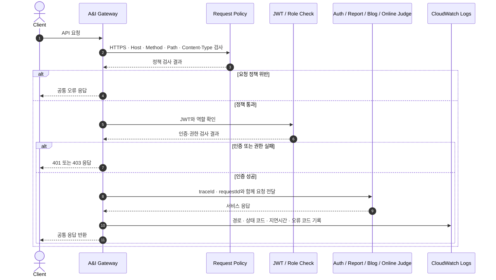
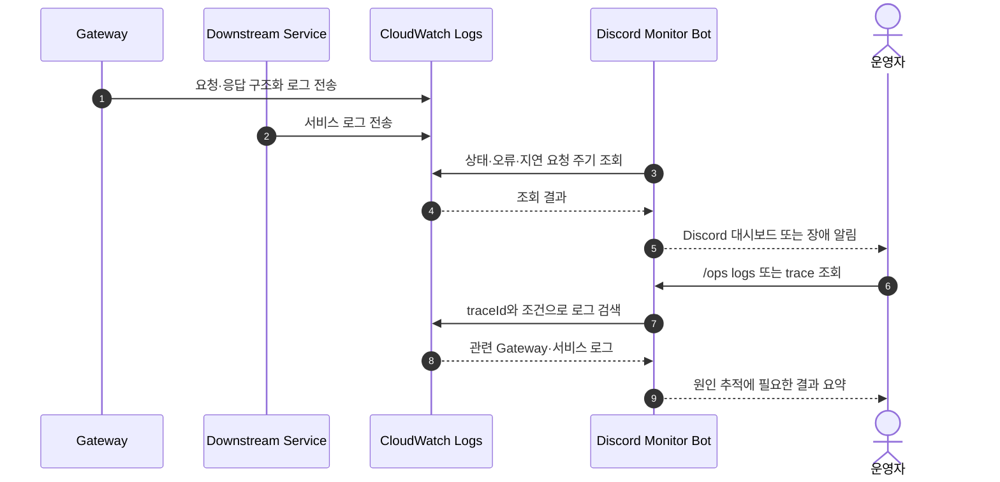

# A&I Gateway Server

> Auth, Report, Blog, Online Judge로 나뉜 A&I 백엔드의 공통 진입점입니다.

클라이언트는 서비스마다 다른 주소와 인증 규칙을 알 필요 없이 Gateway 한 곳으로 요청합니다. Gateway는 요청을 downstream 서버로 전달하기 전에 공통 정책과 권한을 확인하고, 응답이 끝난 뒤에는 같은 요청을 끝까지 추적할 수 있는 로그를 남깁니다.

저장소에는 운영자가 CloudWatch 로그와 서비스 상태를 Discord에서 확인할 수 있도록 만든 Monitor Bot도 함께 포함되어 있습니다.


## 이 저장소가 맡는 역할

| 구간 | 처리 내용 |
| :--- | :--- |
| 요청 진입 | 하나의 도메인에서 외부 요청을 받습니다. |
| 요청 검증 | HTTPS, Host, 메서드, 경로, Content-Type을 확인합니다. |
| 인증과 권한 | JWT를 검증하고 `USER`, `ORGANIZER`, `ADMIN` 권한을 구분합니다. |
| 서비스 연결 | 요청을 Auth, Report, Blog, Online Judge로 전달합니다. |
| 응답 처리 | 오류 형식과 추적 정보를 공통 규칙으로 정리합니다. |
| 운영 확인 | CloudWatch Logs와 Discord를 통해 장애와 지연 요청을 조회합니다. |

## 요청이 처리되는 과정



요청이 downstream에 도달하기 전에 정책과 권한을 확인합니다. 허용되지 않은 요청은 서비스까지 전달하지 않고 Gateway에서 종료합니다.

`traceId`와 `requestId`는 downstream 요청과 구조화 로그에 함께 사용됩니다. 운영자는 같은 ID로 Gateway와 서비스 로그를 이어서 확인할 수 있습니다.

## 운영자가 장애를 확인하는 과정



Discord Monitor Bot은 Gateway JVM과 분리된 Go sidecar입니다. 서버 데이터를 변경하지 않고 상태와 로그만 조회합니다.


| 명령 | 용도 |
| :--- | :--- |
| `/ops dashboard` | 서비스 상태와 현재 알림 현황 확인 |
| `/ops logs` | 오류, 느린 요청, 보안 이벤트, trace 조회 |
| `/ops alert` | 일반 알림과 CRITICAL 알림 채널 설정 |
| `/ops assignment` | 과제 상태와 제출 현황 조회 |
| `/ops help` | 상황별 명령어 확인 |

Discord 요청은 서명과 replay window를 검증합니다. 같은 원인의 장애는 cooldown 동안 반복 전송하지 않으며, CRITICAL 서버 장애만 별도 채널과 허용된 운영자 역할을 mention합니다.


## Gateway 경유 비용 측정

동일한 Mock Downstream을 직접 호출한 경우와 Gateway를 거친 경우를 비교했습니다. 정책·라우팅·로깅 계층이 변경될 때 지연이 크게 늘지 않는지 확인하기 위한 회귀 기준입니다.

| 측정 조건 | 값 |
| :--- | :--- |
| Mock 응답 | 지연 50ms, payload 1KB |
| 부하 | 5 VUs, 1분 |
| 반복 | Direct/Gateway 순서를 바꾸며 3회 |
| k6 | v1.7.1 |

| 3회 중앙값 | 결과 |
| :--- | ---: |
| Direct P95 | 56.959 ms |
| Gateway P95 | 65.357 ms |
| Gateway 추가 P95 | **8.399 ms** |
| HTTP 실패율 | **0.00%** |
| Check 성공률 | **100.00%** |


같은 실행에서 인증·권한·라우팅 오류 계약도 확인했습니다.

| 시나리오 | 결과 |
| :--- | :--- |
| Token 없이 사용자 API 요청 | `401 AUTHENTICATION_FAILED` |
| USER 권한으로 관리자 API 요청 | `403 ACCESS_DENIED` |
| allowlist 밖의 경로 요청 | `404 ENDPOINT_NOT_ALLOWLISTED` |
| Downstream 연결 실패 | `502 DOWNSTREAM_SERVICE_UNAVAILABLE` |
| 로그인 요청 제한 | 12건 중 10건 허용, 2건 차단 |

> 위 수치는 로컬 Mock 환경에서 얻은 회귀 기준이며 운영 환경의 최대 처리량을 의미하지 않습니다.

## 실행 및 테스트

```bash
docker compose up -d redis gateway
curl -i http://localhost:8080/actuator/health
```

```bash
./gradlew test
cd monitor-bot && go test ./...
```

## 기술 스택

| 영역 | 기술 |
| :--- | :--- |
| Gateway | Kotlin 2.2, Java 21, Spring Boot 4, Spring Cloud Gateway WebFlux |
| Security | Spring Security, OAuth2 Resource Server, JWT role policy |
| Cache | Redis Reactive |
| Observability | Structured logging, traceId/requestId, CloudWatch Logs |
| Monitor Bot | Go 1.24, Discord HTTP Interactions, AWS SDK |
| Infra | Docker, Docker Compose, Nginx, GitHub Actions |
| Performance | k6 |

## 참고 문서

- [Gateway 오류 계약](./docs/GATEWAY_ERROR_CODES.md)
- [서비스 연동 원칙](./docs/SERVICE_GATEWAY_INTEGRATION.md)
- [성능 측정 환경과 전체 결과](./docs/PERFORMANCE.md)
- [Discord Monitor Bot 실행과 운영](./monitor-bot/README.md)
