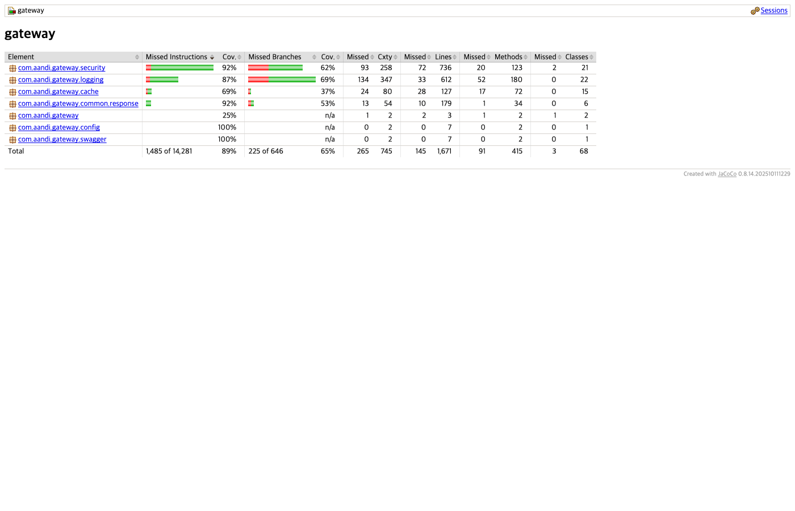

# Measurement

> 랜딩 페이지로 돌아가기: [README](../README.md)

본 문서는 A-AND-I-GATEWAY-SERVER의 테스트, 커버리지, 로컬 smoke check, 성능 측정 가능 여부를 분리해 기록합니다. 확인한 수치만 적고, latency와 throughput의 before/after 값은 현재 없습니다.

## 실행 환경

| 항목 | 값 |
| :--- | :--- |
| Gateway | Kotlin, Java 21, Spring Boot 4, Spring Cloud Gateway |
| Monitor Bot | Go 1.24 |
| Cache | Redis reactive |
| DB / ERD | 애플리케이션 소유 RDB/MongoDB 없음. Redis cache/state 중심이라 ERD는 작성하지 않습니다. |
| CI | `.github/workflows/ci.yml`, `.github/workflows/cd.yml` |

## 테스트 결과

| 명령 | 결과 | 확인 내용 |
| :--- | :--- | :--- |
| `./gradlew clean test` | PASS | JVM/Spring 테스트 |
| `./gradlew jacocoTestReport` | PASS | JaCoCo XML/HTML report 생성 |
| `./gradlew jacocoTestCoverageVerification` | PASS | threshold rule은 설정하지 않음 |
| `cd monitor-bot && go test ./...` | PASS | 11개 Go package 테스트 |
| `cd monitor-bot && go test ./... -cover` | PASS | package별 Go coverage 출력 |
| `cd monitor-bot && go test ./... -coverprofile=coverage.out` | PASS | Go coverage profile 생성 |
| `cd monitor-bot && go tool cover -func=coverage.out` | PASS | Go total statements `59.2%` |

## Coverage



JaCoCo report root counter 기준:

| Metric | Covered / Total | Coverage |
| :--- | :--- | ---: |
| Instruction | 12,796 / 14,281 | 89.60% |
| Branch | 421 / 646 | 65.17% |
| Line | 1,526 / 1,671 | 91.32% |

Go coverage:

| Package | Coverage |
| :--- | ---: |
| `cmd/monitor-bot` | 19.8% |
| `internal/cloudwatch` | 58.6% |
| `internal/config` | 53.8% |
| `internal/discord` | 34.2% |
| `internal/formatting` | 72.1% |
| `internal/health` | 64.5% |
| `internal/monitor` | 63.7% |
| `internal/opslog` | 80.9% |
| `internal/reportadmin` | 75.7% |
| `internal/security` | 78.1% |
| `internal/state` | 67.9% |
| Total statements | 59.2% |

## Local Smoke Check

운영 인증값 없이 내부 이벤트 검증값을 로컬 더미값으로 주입해 Gateway를 실행했습니다. 더미값 자체는 문서에 남기지 않습니다.

```bash
SERVER_PORT=18080 MANAGEMENT_SERVER_PORT=19090 ./gradlew bootRun
curl -sS -i http://localhost:19090/actuator/health
curl -sS -i http://localhost:18080/not-allowlisted
```

확인 결과:

- management health: `HTTP/1.1 200 OK`
- denylisted route: `HTTP/1.1 404 Not Found`
- Gateway 공통 실패 응답: `success=false`, `error.code=15001`, `value=ENDPOINT_NOT_ALLOWLISTED`

## CI 확인

`.github/workflows/ci.yml`에서 확인한 검증:

- JVM test: `./gradlew test`
- Go test: `cd monitor-bot && go test ./...`
- JVM build: `./gradlew build -x test`
- 실패 시 artifact: `build/reports/tests/test/`

`.github/workflows/cd.yml`도 배포 전에 JVM test와 monitor-bot Go test를 실행합니다.

## 성능 측정 상태

| 항목 | 상태 |
| :--- | :--- |
| Gateway p95 latency | 현재 before/after 측정값은 없습니다 |
| alert delivery latency | 현재 before/after 측정값은 없습니다 |
| Discord command response time | 현재 before/after 측정값은 없습니다 |
| duplicate alert count | 현재 before/after 측정값은 없습니다 |
| Gateway throughput | 현재 before/after 측정값은 없습니다 |

향후 성능 문장을 쓰려면 같은 log group, 같은 조회 기간, 같은 service set으로 CloudWatch Logs Insights 결과를 반복 측정해야 합니다. 현재는 성능 개선률, 장애 감지 시간 단축률, throughput 개선률을 이력서에 쓰지 않습니다.
