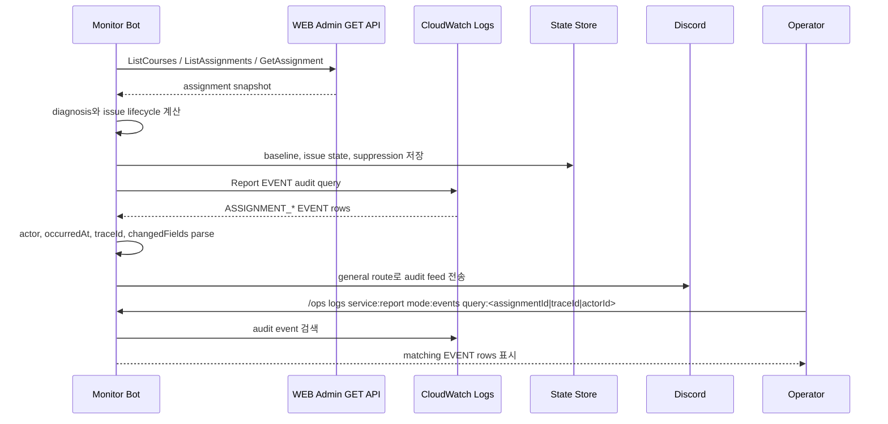

# Assignment Audit Flow

> 문서 목차로 돌아가기: [Gateway Docs](../README.md)

본 흐름은 assignment 현재 상태 조회와 변경 주체 증명을 분리합니다. WEB Admin GET API는 현재 snapshot과 diagnosis에 사용하고, 변경 주체와 시각은 Report V2 `EVENT` 로그를 source of truth로 사용합니다.

## Source of Truth

| 질문 | source |
| :--- | :--- |
| 현재 과제 상태는 무엇인가 | WEB Admin GET API |
| 누가 과제를 수정했는가 | Report V2 `EVENT` log |
| 언제 공개/비공개가 발생했는가 | Report V2 `EVENT` log |
| 삭제된 과제를 조회할 수 없는가 | Report V2 `EVENT` log로 actor/time 확인 |
| publish delayed 같은 상태 이상인가 | WEB Admin API snapshot + monitor-bot diagnosis |

## Sequence

## 대상 이벤트

- `ASSIGNMENT_CREATED`
- `ASSIGNMENT_UPDATED`
- `ASSIGNMENT_DELETED`
- `ASSIGNMENT_PUBLISHED`
- `ASSIGNMENT_UNPUBLISHED`

## Read-only 원칙

monitor-bot은 assignment write command를 제공하지 않습니다.

- 생성/수정/삭제/공개/비공개 command 없음
- Report Admin POST/PATCH/DELETE API 호출 없음
- 허용된 예외: admin access token 갱신을 위한 Auth refresh API 호출

## Source

- Admin GET client: `monitor-bot/internal/reportadmin/client.go`
- assignment issue diagnosis: `monitor-bot/internal/monitor/assignment_ops.go`
- audit parser: `monitor-bot/internal/monitor/assignment_audit.go`
- audit query: `monitor-bot/internal/cloudwatch/queries.go`
