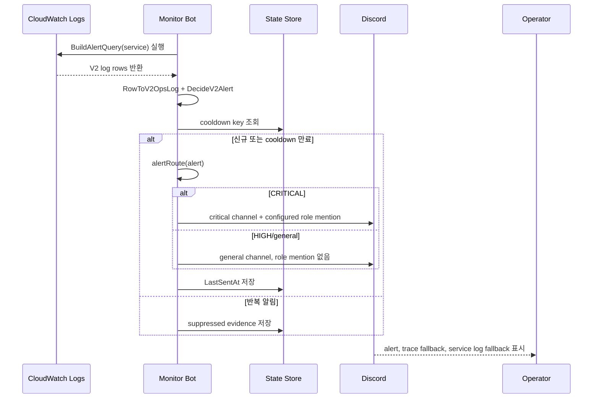

# Ops Alert Flow

> 문서 목차로 돌아가기: [Gateway Docs](../README.md)

본 흐름은 CloudWatch Logs structured V2 fields를 기반으로 service alert를 수집하고, severity에 따라 general 또는 critical route로 전송하는 과정을 설명합니다.

## 기준

| 항목 | 내용 |
| :--- | :--- |
| 조회 대상 | `gateway`, `auth`, `report`, `post/blog` |
| query source | CloudWatch Logs Insights |
| critical 조건 | `CRITICAL` level/severity 또는 explicit critical error code |
| general 조건 | HIGH service alert, assignment audit, assignment WARN/INFO |
| role mention | critical alert에서만 configured role 사용 |
| 금지 mention | `@everyone`, `@here` |

## Sequence

## Source

- `monitor-bot/internal/cloudwatch/queries.go`
- `monitor-bot/internal/opslog/v2.go`
- `monitor-bot/internal/monitor/alerts.go`
- `monitor-bot/internal/state/store.go`

## 검증 포인트

- `CRITICAL`만 critical route와 role mention을 사용합니다.
- `HIGH`, assignment audit, assignment WARN/INFO는 role mention을 사용하지 않습니다.
- alert fingerprint/cooldown key로 반복 알림을 억제합니다.
- traceId가 유효하면 `Trace 상세` 버튼과 fallback command를 함께 제공합니다.
