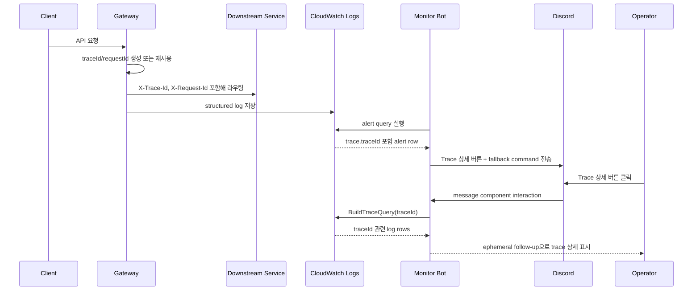

# Trace Drilldown Flow

> 문서 목차로 돌아가기: [Gateway Docs](../README.md)

본 흐름은 Gateway가 생성/재사용한 traceId를 CloudWatch Logs와 Discord alert에서 다시 조회하는 과정을 설명합니다.

## Sequence



## Fallback Command

```text
/ops logs mode:trace query:<traceId>
```

## Source

- trace header: `src/main/kotlin/com/aandi/gateway/logging/RequestResponseLoggingFilter.kt`
- structured log: `src/main/kotlin/com/aandi/gateway/logging/ApiLogFactory.kt`
- trace query: `monitor-bot/internal/cloudwatch/queries.go`
- button custom ID: `monitor-bot/internal/discord/components.go`
- button execution: `monitor-bot/internal/discord/interactions.go`

## 검증 포인트

- traceId가 없으면 Gateway가 새 값을 생성합니다.
- traceId가 있으면 재사용하고 response header에도 남깁니다.
- Discord button이 실패해도 fallback slash command가 alert 본문에 남습니다.
- traceId validation을 통과한 값만 button custom ID에 사용합니다.
