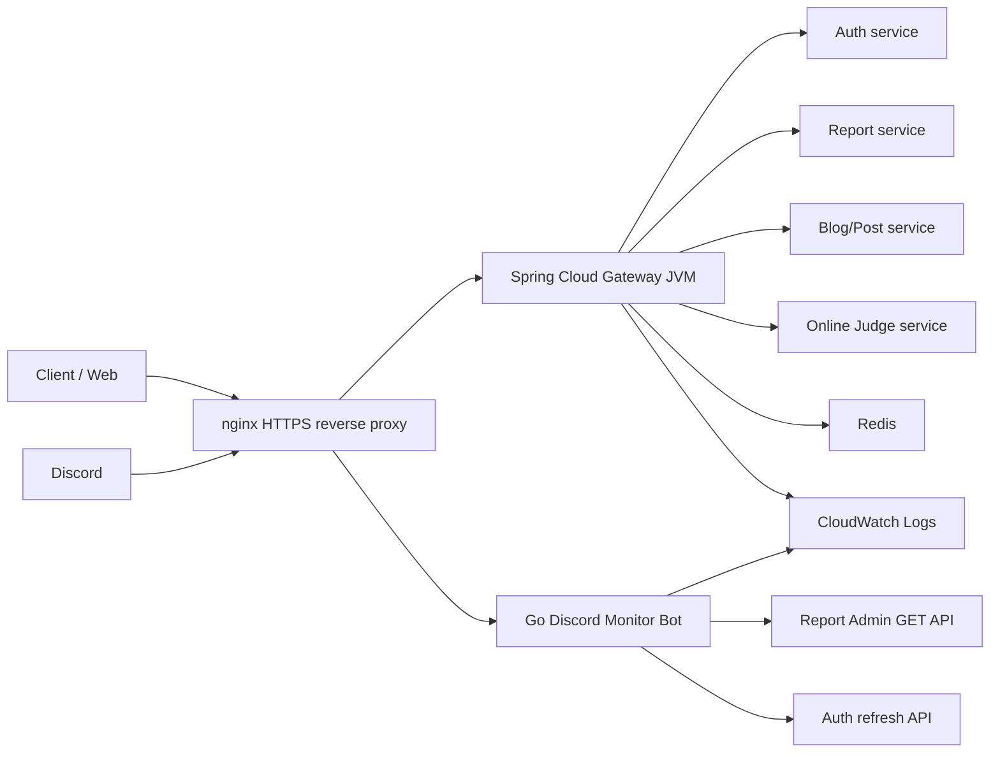

# Architecture

> 메인 README로 돌아가기: [README](../README.md)

본 프로젝트는 Spring Cloud Gateway WebFlux 서버와 Go 기반 Discord Monitor Bot을 함께 배포하는 구조입니다. Gateway는 외부 API 요청을 내부 MSA 서비스로 라우팅하고, monitor-bot은 운영자가 Discord에서 CloudWatch Logs와 read-only Admin API를 조회하도록 돕습니다.

## 구성 요소

| 구성 요소 | 역할 | 근거 |
| :--- | :--- | :--- |
| Gateway JVM | route, 인증/인가, 요청 정책, 공통 응답 writer | `src/main/resources/application.yaml`, `SecurityConfig.kt`, `GatewayRequestPolicyFilter.kt` |
| Redis | token context cache와 rate limit 저장소 | `docker-compose.yml`, `RedisConfig.kt`, `AuthRateLimitFilter.kt` |
| Downstream services | Auth, Report, Blog/Post, Online Judge 라우팅 대상 | `application.yaml`, `.github/workflows/cd.yml` |
| Go monitor-bot | Discord HTTP Interactions sidecar, CloudWatch Logs 조회, read-only assignment 조회 | `monitor-bot/`, `monitor-bot/README.md` |
| CloudWatch Logs | Gateway와 서비스 structured log 저장, monitor-bot query 대상 | `monitor-bot/internal/cloudwatch/queries.go`, `docs/log-retention.md` |
| nginx | `/discord/interactions`는 monitor-bot으로, 일반 API는 Gateway로 프록시 | `.github/workflows/cd.yml` |

## Runtime Flow

## Gateway 책임

Gateway는 모든 downstream 기능을 직접 구현하지 않습니다. 대신 다음 정책을 Gateway 경계에서 적용합니다.

- route allowlist와 explicit deny rule
- HTTPS와 Host 정책
- JSON Content-Type 정책
- JWT issuer/audience/token type 검증
- role 기반 접근 제어
- 공통 실패 응답 writer
- trace header 생성/재사용과 structured log 생성

## Monitor Bot 책임

monitor-bot은 Gateway 프로세스와 분리된 sidecar입니다. Discord Gateway WebSocket을 열지 않고 HTTP Interactions endpoint만 받으며, 운영자가 Discord에서 로그와 상태를 읽도록 돕습니다.

- CloudWatch Logs structured V2 fields 조회
- `/ops dashboard`, `/ops logs`, `/ops alert`, `/ops assignment`, `/ops help`
- critical/general alert routing
- Report Admin GET API 기반 assignment snapshot/diagnosis
- Report V2 EVENT 로그 기반 assignment audit feed
- `/healthz` 기반 container health check

## 분리 이유

운영 조회 도구는 Discord token, CloudWatch 권한, alert state를 다룹니다. 이 기능을 Gateway JVM 안에 넣으면 운영 도구 장애가 API Gateway 안정성에 직접 영향을 줄 수 있습니다. 현재 구조는 monitor-bot을 별도 Go container로 배포해 Gateway API 처리와 Discord 운영 조회를 분리합니다.

## 확인된 제한

- Gateway JVM coverage 플러그인은 현재 `build.gradle.kts`에서 확인되지 않습니다.
- Gateway latency before/after 측정 리포트는 현재 문서나 빌드 산출물에서 확인되지 않습니다.
- Discord GIF 데모는 운영 Discord token과 CloudWatch 접근권이 필요해 자동 생성하지 않았습니다. Gateway 공통 에러 응답 screenshot은 로컬 실행으로 생성했고, 기준은 [Demo Capture](./demo-capture.md)에 남겼습니다.
