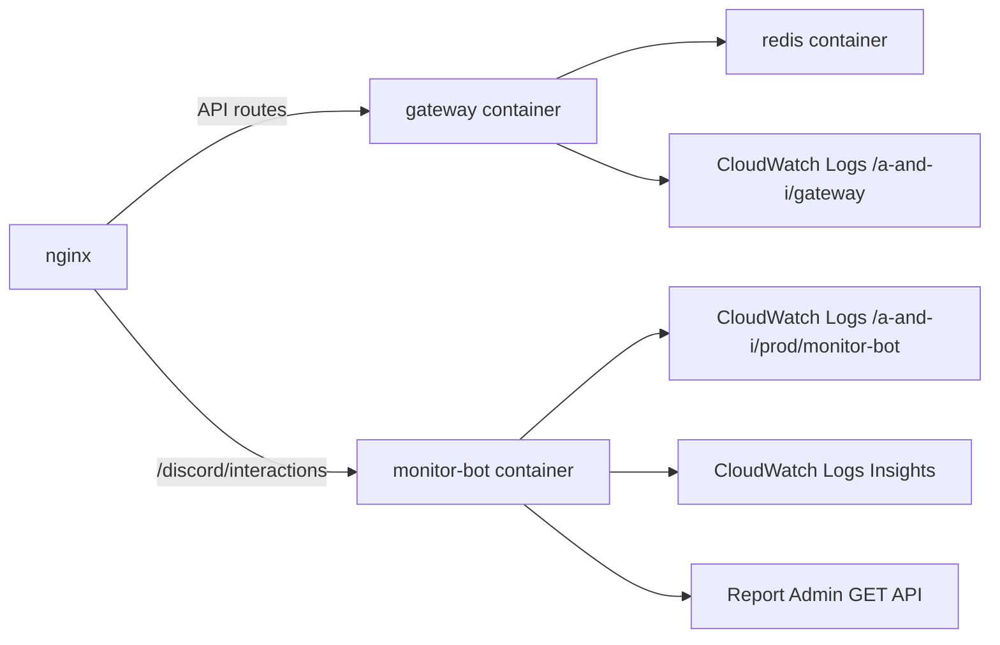

# Deployment

> 메인 README로 돌아가기: [README](../README.md)

본 프로젝트는 Gateway JVM과 monitor-bot Go sidecar를 별도 Docker image로 빌드합니다. GitHub Actions CD workflow는 tag 또는 수동 실행에서 ECR push 후 EC2의 docker compose 정의를 갱신합니다.

## CI

`.github/workflows/ci.yml`은 push와 pull request에서 다음 검증을 실행합니다.

| 단계 | 내용 |
| :--- | :--- |
| Setup Java 21 | Gateway JVM 테스트 준비 |
| `./gradlew test` | Kotlin/Spring Gateway 테스트 |
| Setup Go | `monitor-bot/go.mod` 기준 Go 버전 설정 |
| `cd monitor-bot && go test ./...` | monitor-bot 패키지 테스트 |
| `./gradlew build -x test` | 테스트를 제외한 JAR build |
| failure artifact | 실패 시 `build/reports/tests/test/` 업로드 |

## CD

`.github/workflows/cd.yml`은 다음 흐름을 갖습니다.

1. Java 21, Gradle, Go를 설정합니다.
2. `./gradlew test`와 `cd monitor-bot && go test ./...`를 실행합니다.
3. Gateway JAR를 build합니다.
4. Gateway Docker image와 monitor-bot Docker image를 각각 ECR에 push합니다.
5. EC2에서 nginx, gateway, monitor-bot, redis compose 파일을 갱신합니다.
6. Gateway readiness와 monitor-bot `/healthz`를 확인합니다.
7. nginx config test 후 reload 또는 start를 수행합니다.

## Runtime 배치

## monitor-bot 배포 기준

- 별도 image tag: `monitor-bot-${release}`
- default port: `8088`
- nginx는 `/discord/interactions`만 monitor-bot `/interactions`로 프록시합니다.
- compose memory limit은 `96m`, CPU limit은 `0.20`으로 설정됩니다.
- state volume은 `/var/lib/monitor-bot`에 연결됩니다.
- Docker socket은 mount하지 않습니다.

## CloudWatch Logs

CD workflow는 log group 생성과 retention policy 설정을 시도합니다. 기본 retention은 14일이며 `CLOUDWATCH_LOG_RETENTION_DAYS` 값으로 조정할 수 있습니다.

관련 문서: [Log Retention Policy](./log-retention.md)

## 배포 시 주의

- 실제 secret 값은 문서에 기록하지 않습니다.
- Discord command schema 변경을 운영에 반영할 때만 `DISCORD_REGISTER_COMMANDS=true`로 1회 실행합니다.
- monitor-bot의 registration failure는 `/healthz`에 표시되며, `STRICT_STARTUP_CHECKS=true`가 아니면 프로세스를 재시작하지 않습니다.
- 실패 artifact 업로드는 CI workflow의 JVM test report에 한정되어 있습니다. Go coverage artifact 업로드는 현재 workflow에서 확인되지 않습니다.
