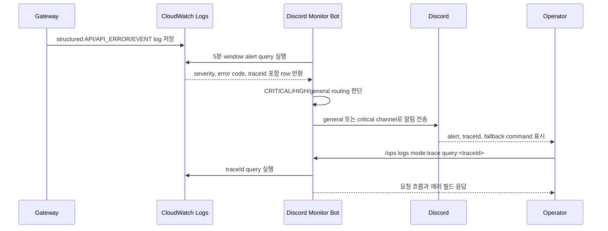

# Observability

> 메인 README로 돌아가기: [README](../README.md)

본 프로젝트의 관찰가능성 목표는 MSA 환경에서 흩어진 서비스 로그와 운영 이벤트를 Discord에서 먼저 확인하고, traceId 기준으로 세부 로그까지 추적하는 것입니다. 현재 before/after 탐지 시간 측정값은 없으므로 장애 감지 시간 단축률은 작성하지 않습니다.

## 문제

MSA에서는 Gateway, Auth, Report, Blog/Post, Online Judge 로그가 서비스별로 분리됩니다. 운영자가 각 서버나 로그 그룹을 직접 확인해야 하면 장애 탐지가 늦어지고, 특정 요청이 어느 서비스에서 실패했는지 추적하는 데 시간이 걸립니다.

## 행동

Gateway는 structured log에 다음 필드를 포함합니다.

- `service.name`, `service.domain`, `service.domainCode`
- `trace.traceId`, `trace.requestId`
- `http.method`, `http.path`, `http.route`, `http.statusCode`, `http.latencyMs`
- `response.success`, `response.error.code`, `response.error.value`, `response.error.alert`

monitor-bot은 CloudWatch Logs Insights query로 이 필드를 조회합니다.

- `/ops dashboard`: 서비스별 health/log/error 요약
- `/ops logs`: errors, critical, slow, security, events, trace 조회
- `/ops alert`: general/critical channel과 role mention 설정
- `/ops assignment`: WEB Admin GET API snapshot과 Report EVENT audit 조회

## 결과

운영자는 Discord에서 이상 신호를 먼저 확인하고, alert 메시지의 fallback command 또는 버튼으로 trace drilldown을 실행합니다. critical alert는 critical route로 보내고, 일반 운영 로그와 assignment audit은 general route로 보냅니다.

## 장애 감지 흐름

## Alert Routing 요약

| 분류 | route | role mention | 근거 |
| :--- | :--- | :--- | :--- |
| CRITICAL server alert | critical | configured role만 허용 | `monitor-bot/internal/monitor/alerts.go` |
| HIGH service alert | general | 없음 | `monitor-bot/internal/opslog/v2.go` |
| assignment audit | general | 없음 | `monitor-bot/internal/monitor/assignment_audit.go` |
| assignment WARN/INFO issue | general | 없음 | `monitor-bot/internal/monitor/assignment_ops.go` |

## Trace Drilldown

Gateway의 `RequestResponseLoggingFilter`는 요청 trace header를 재사용하거나 생성합니다. monitor-bot은 `trace.traceId`가 있는 alert에 `Trace 상세` 버튼을 붙이고, 버튼이 실패할 때 사용할 `/ops logs mode:trace query:<traceId>` fallback도 메시지에 남깁니다.

## 측정값 상태

- 장애 감지 시간 before/after: 현재 측정값 없음
- alert delivery latency: 현재 측정값 없음
- p95 Gateway latency: CloudWatch query는 p95 계산을 지원하지만 현재 결과 리포트 없음
- duplicate alert count: state 기반 suppression은 구현되어 있으나 운영 측정값 없음

측정 기준은 [Performance Measurement](./performance-measurement.md)에 정리했습니다.
